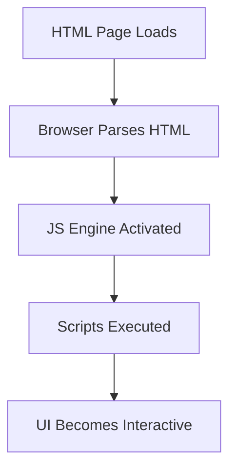

# 📘 Introduction to JavaScript

## 🧾 What is JavaScript?

**JavaScript** is a **high-level, interpreted** programming language that runs in the browser and on servers (via Node.js). It is **the language of the web**, allowing you to make your websites **interactive, dynamic, and user-friendly**.

> JavaScript can update content, validate forms, animate images, handle events, and much more – all in real-time without refreshing the page.

---

## 🚀 Why Learn JavaScript?

- 🔗 Runs in every browser (Chrome, Firefox, Safari, Edge)
- 🖥️ Powers modern web apps (like YouTube, Facebook, Twitter)
- ⚙️ Works both on **frontend** and **backend** (Node.js)
- 🌐 Part of the core trio of web: **HTML + CSS + JavaScript**
- 📱 Used in mobile, game, AI, and desktop app development

---

## 🛠️ Features of JavaScript

- ✅ Lightweight and easy to learn
- ✅ Event-driven and asynchronous
- ✅ Object-oriented with prototype-based inheritance
- ✅ Supports functional programming
- ✅ Massive ecosystem with npm
- ✅ ES6+ for modern syntax (let, const, arrow functions, etc.)

---

## ✍️ Basic Syntax Example

```html
<!DOCTYPE html>
<html>
  <head>
    <title>JavaScript Intro</title>
  </head>
  <body>
    <h1>Hello, JavaScript!</h1>
    <script>
      // This is a JavaScript comment
      let message = "Welcome to JavaScript!";
      alert(message); // Show popup
      console.log("Message logged:", message); // Print in console
    </script>
  </body>
</html>
```

📎 This basic example shows how JavaScript interacts with HTML to create dynamic behavior.

## 📊 Mermaid Diagram – JavaScript in Web



---

## 🌍 Where is JavaScript Used?

* 🌐 **Web Development** – Interactivity in websites
* ⚙️ **Backend Development** – With Node.js
* 🤖 **AI & Machine Learning** – TensorFlow\.js
* 📱 **Mobile App Development** – React Native, Ionic
* 🎮 **Game Development** – Phaser, Three.js
* 🖥️ **Desktop Apps** – Electron.js

---


## ❓ JavaScript FAQs

**Q: Is JavaScript the same as Java?**

🅰️ No! Java and JavaScript are two completely different languages. Java is compiled and statically typed. JavaScript is interpreted and dynamically typed.

**Q: Does JavaScript need a compiler?**

🅰️ No compiler needed. Browsers like Chrome have engines (e.g., V8) that interpret JavaScript directly.

**Q: Can JavaScript run outside the browser?**

🅰️ Yes! Using Node.js, JavaScript can run on servers and even handle backend logic.

---

## 🧠 Interview Prep: Common Questions

**1. What is JavaScript and how does it differ from HTML/CSS?**

🅰️ JavaScript is a lightweight, interpreted scripting language primarily used for adding interactivity to web pages.
Java is a compiled, class-based language used for building complex applications like Android apps, enterprise systems, and desktop tools.

**2. How is JavaScript executed in the browser?**

🅰️ JavaScript is executed by the JavaScript engine built into every modern browser (like V8 in Chrome, SpiderMonkey in Firefox).

📋 Execution Flow:

1. The browser downloads the HTML page.
2. It parses the HTML and encounters the <script> tag.
3. The browser invokes its JavaScript engine.
4. The engine compiles (just-in-time) and executes the script.
5. JavaScript interacts with the DOM, handles events, and updates the UI dynamically.

🔄 It runs on a single thread using an event loop and call stack to handle asynchronous operations (e.g., timers, fetch requests).

**3. Can JavaScript work without HTML?**

🅰️ ✅ Yes!
JavaScript can run independently of HTML, especially on the server-side using platforms like Node.js.

Use-cases where JS works without HTML:

* CLI tools
* APIs and servers (e.g., Express.js)
* Automation scripts
* Machine learning (e.g., TensorFlow.js)
* Unit testing with Jest, Mocha

However, in the browser context, it usually interacts with HTML to manipulate UI elements.

**4. Name some use-cases of JavaScript in modern development.**

🅰️ JavaScript is used everywhere in modern development:

| Area           | Use-Case                                                    |
| -------------- | ----------------------------------------------------------- |
| 🌐 Frontend    | DOM manipulation, animations, SPAs with React, Vue, Angular |
| 🧠 Backend     | API development with Node.js, Express                       |
| 📱 Mobile Apps | React Native, Ionic for cross-platform apps                 |
| 🤖 AI/ML       | TensorFlow\.js, Brain.js for machine learning in browsers   |
| 🕹️ Game Dev   | HTML5 games, 2D/3D engines (Phaser, Babylon.js)             |
| ⚙️ Dev Tools   | Task runners (Gulp), Linters (ESLint), Bundlers (Webpack)   |
| 🧪 Testing     | Unit and integration testing with Jest, Mocha, Cypress      |


**5. Is JavaScript statically typed or dynamically typed?**

🅰️ JavaScript is dynamically typed, meaning:

* Variable types are determined at runtime, not compile-time.
* You can assign a number, then reassign a string to the same variable.

  ```js
  let value = 42;      // number
  value = "Hello JS";  // now a string
  ```

---

## 💡 Fun Fact
> JavaScript was created in just 10 days by Brendan Eich in 1995 at Netscape.

## 📝 Summary

* JavaScript adds life to web pages.
* It's essential for any modern web or full-stack developer.
* Easy to start with, powerful to scale up.

---

## 📣 Connect with Me

If you like this series:

* 🔔 **Follow & Star** the repo

* Explore more JavaScript tutorials and real-world projects at: Learn & build with real-world code.

---

## ▶️ Next Up

➡️ [Variables & Data Types](../02-variables/README.md)
