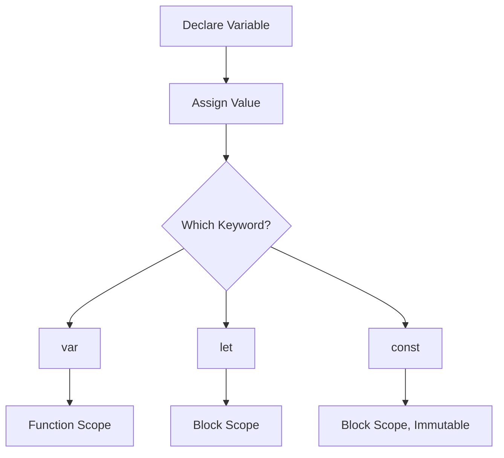

# 🧮 Variables & Data Types in JavaScript

Variables are the **building blocks** of any programming language. They store data that your code can use and manipulate.

JavaScript is a **dynamically typed** language, meaning you don’t need to declare the data type of a variable explicitly — it is determined at runtime.

---

## 📦 What is a Variable?

A **variable** is a container for storing data values.

```js
let message = "Hello, world!";
```

* `let` is the keyword.
* `message` is the variable name.
* `"Hello, world!"` is the assigned value.

---

## 🛠️ Declaring Variables in JavaScript

JavaScript provides three ways to declare variables:

| Keyword | Scope           | Reassignment | Hoisting                               | Use Case                              |
| ------- | --------------- | ------------ | -------------------------------------- | ------------------------------------- |
| `var`   | Function-scoped | ✅ Yes        | ✅ Hoisted (initialized as `undefined`) | Legacy code                           |
| `let`   | Block-scoped    | ✅ Yes        | ✅ Hoisted (not initialized)            | Recommended for variables that change |
| `const` | Block-scoped    | ❌ No         | ✅ Hoisted (not initialized)            | Recommended for constants             |

### 🔍 Example:

```js
var name = "Ajay";
let age = 23;
const country = "India";
```

---

## 🧪 JavaScript Data Types

JavaScript has **two main categories** of types:

### 🔹 1. Primitive Types

| Type        | Example         | Description                       |
| ----------- | --------------- | --------------------------------- |
| `String`    | `"Hello"`       | Textual data                      |
| `Number`    | `42`, `3.14`    | Integer or floating point numbers |
| `Boolean`   | `true`, `false` | Logical true or false             |
| `Null`      | `null`          | Intentionally empty value         |
| `Undefined` | `undefined`     | Declared but not assigned         |
| `Symbol`    | `Symbol("id")`  | Unique and immutable identifier   |
| `BigInt`    | `123n`          | Large integers                    |

### 🔹 2. Non-Primitive (Reference) Types

* `Object`
* `Array`
* `Function`
* `Date`, `RegExp`, etc.

### 🧠 Typeof Example:

```js
console.log(typeof 123);         // "number"
console.log(typeof "JS");        // "string"
console.log(typeof null);        // "object" (quirk in JS)
console.log(typeof undefined);   // "undefined"
```

---

## 🗺️ Mermaid Diagram – Variable Declaration Flow



---

## 💡 Best Practices

* ✅ Use `let` for variables you plan to reassign.
* ✅ Use `const` by default unless reassignment is needed.
* 🚫 Avoid `var` unless working in legacy code.
* ✅ Use meaningful variable names (e.g., `userAge`, `isLoggedIn`).

---

## ❓ Interview Questions & Answers

**1. What is the difference between var, let, and const?**

* `var`: Function-scoped, hoisted, can be redeclared.
* `let`: Block-scoped, hoisted but not initialized.
* `const`: Block-scoped, cannot be reassigned.

**2. What are primitive and non-primitive data types?**

* Primitive: Single values (e.g., string, number, boolean).
* Non-primitive: Objects and functions (reference-based).

**3. Why is typeof null an object?**

It’s a **legacy bug** in JavaScript's original implementation. Technically, `null` is a primitive.

**4. Can we change the value of a const variable?**

No, `const` variables **cannot be reassigned**. However, for objects and arrays, their contents **can** be mutated.

```js
const person = { name: "Ajay" };
person.name = "Dhangar"; // ✅ Allowed
person = { name: "Someone" }; // ❌ Error
```

**5. What does dynamically typed mean in JavaScript?**

It means **data types are assigned at runtime**, and the same variable can hold values of different types during execution.
---

## ✅ Summary

* JavaScript uses `var`, `let`, and `const` to declare variables.
* It supports both **primitive** and **non-primitive** data types.
* Variables are **dynamically typed**.
* Use `let` and `const` for modern, safe coding practices.

> 🎯 Mastering variables and data types is crucial to writing clean, bug-free JavaScript code.

---

## ⏭️ Next Up

Continue your learning in the next section: [Operators in JavaScript](../03-operators/README.md)
