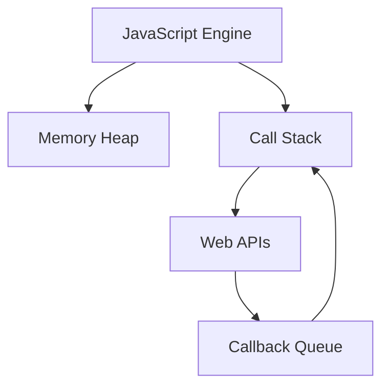

# 📘 Learn JavaScript – Master JavaScript from Zero to Hero 🚀

Welcome to the **Learn JavaScript** repository – your ultimate JavaScript roadmap designed for beginners, intermediates, and aspiring developers! This repo is your go-to resource for **mastering JavaScript** through hands-on examples, real-world interview prep, visual diagrams (Mermaid), and detailed explanations.

> 📌 Whether you're just starting out or preparing for technical interviews, this repository will help you **understand, implement, and master** core JavaScript concepts with clarity.

---

## 📌 What You'll Get in This Repository

✅ Beginner to Advanced Concepts  
✅ Code Examples + Syntax Highlighting  
✅ Mermaid Diagrams for Visual Learning  
✅ Real-life Use Cases & Interview Questions  
✅ Clear Explanations with Code & Output  
✅ Regular Updates  
✅ Easy-to-Navigate Table of Contents  
✅ Learn-by-Doing Projects (Coming Soon)

---

## 📚 Table of Contents

> Each topic will be divided into:  
> ✅ Concept + Explanation  
> ✅ Syntax & Examples  
> ✅ Real-life Scenarios  
> ✅ Mermaid Diagrams (where applicable)  
> ✅ Interview Q&A  
> ✅ Tips & Best Practices  

### 🔰 Basics
- [Introduction to JavaScript](./01-introduction/README.md)
- [Variables & Data Types](./02-variables/README.md)
- [Operators](./03-operators/README.md)
- [Control Flow – If/Else, Switch](./04-control-flow/README.md)
- [Loops – for, while, do-while](./05-loops/README.md)

### 🧠 Core Concepts
- [Functions & Scope](./06-functions/README.md)
- [Arrays & Array Methods](./07-arrays/README.md)
- [Objects & Object Methods](./08-objects/README.md)
- [Classes & OOP](./09-classes/README.md)
- [Inheritance & Prototypes](./10-inheritance/README.md)

### 🚀 Advanced JavaScript
- [ES6+ Features](./11-es6-features/README.md)
- [Modules (import/export)](./12-modules/README.md)
- [Asynchronous JavaScript (Callbacks, Promises)](./13-promises/README.md)
- [Async/Await](./14-async-await/README.md)
- [JavaScript Event Loop & Call Stack](./15-event-loop/README.md)

### 🧩 Deeper Dive
- [Closures](./16-closures/README.md)
- [Hoisting](./17-hoisting/README.md)
- [This Keyword](./18-this-keyword/README.md)
- [Memory Management & Garbage Collection](./19-memory/README.md)
- [JavaScript in the Browser (DOM)](./20-dom/README.md)
- [Error Handling (try/catch)](./21-error-handling/README.md)

### 🛠️ Practice & Interview Preparation
- [Common Interview Questions](./interviews/questions.md)
- [Code Snippets for Interviews](./interviews/snippets.md)
- [Mini Challenges](./interviews/challenges.md)
- [JavaScript Projects (coming soon)](./projects/README.md)

---

## 🧠 Learn with Visuals – Mermaid Diagrams

We include diagrams to explain complex topics such as:
- Call Stack
- Event Loop
- Promise Chains
- Prototypal Inheritance
- Execution Context & Scope Chain

---

## 📝 Copyright & Usage

All content in this repository is **copyright © Ajay Dhangar**.
Feel free to **fork**, **clone**, or **star**, but **do not copy content for commercial use** without permission.

---

## 📣 Stay Connected!

If this repo helps you, please consider:

🌟 Starring this repository
🔁 Sharing it with your friends
👣 Following me on [GitHub](https://github.com/ajay-dhangar)
💼 Connect with me on [LinkedIn](https://www.linkedin.com/in/ajay-dhangar/)
🌍 Connect with my website on [CodeHarborHub](https://codeharborhub.github.io/)

---

## 🙌 Let's Get Started!

Dive into the `01-introduction` folder and start your JavaScript journey today!

> **Keep learning, keep building. JavaScript mastery begins here! 💪**
